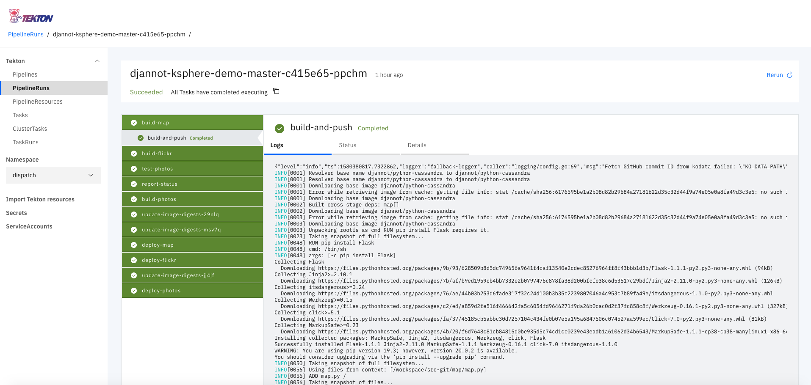
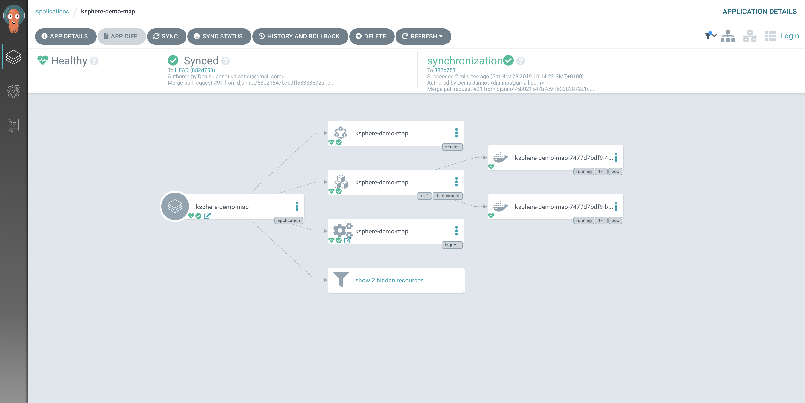
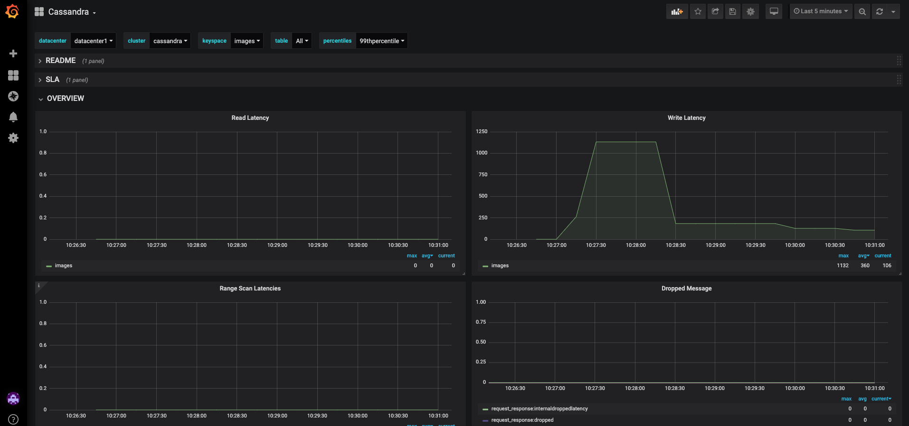

# Ksphere demo

## Introduction

The goal of the Ksphere demo is to highlight the benefits of all the D2iQ Ksphere products in a single demo:

- the ability to deploy a Konvoy Kubernetes cluster in a few minutes using Kommander
- the ability to deploy Apache Kafka and Cassandra using KUDO
- the ability to monitor Apache Kafka and Cassandra using Prometheus and Grafana that are built-in Konvoy
- the ability to build and deploy micro services using Dispatch

The demo will continue to evolve in conjunction with the new features that will be implemented in the Ksphere product line (Local repository, Service Mesh, ...).


This demo is composed of 3 micro services:

- the `flickr` micro service that gets pictures of sunsets from the Flickr API and upload them in a Minio bucket. Minio produce a message in a Kafka topic for each object being created.
- the `photos` micro service that consume the Kafka topic, download the corresponding pictures from the Minio bucket, extract the GPS location from the pictures metadata and store the information in Cassandra.
- the `map` micro service that reads the information from Cassandra and display the pictures in a map.

Dispatch is used to build and deploy these micro services.
But there are 2 versions of the `map` micro service and when we modify the version, the new commit in the repo triggers an update of the micro service (through Dispatch).

A recording of the demo is available here:

[https://drive.google.com/open?id=1IorubmprAaz7pI84q_WaWRonh9a1MHmU](https://drive.google.com/open?id=1IorubmprAaz7pI84q_WaWRonh9a1MHmU)

## Prerequisites

### Required script tools

Netcat (nc) for testing availability of load balancer services and JSON query (jq) for JSON manipulation

On Mac
```sh
brew install netcat jq
```

On Linux
```sh
## Debian/Ubuntu
sudo apt install netcat jq
## Red Hat/Centos
sudo yum install nc jq
```

### Client tools

Download the Dispatch CLI version `0.5.1` (for either Linux or Mac) from the following page:

[https://github.com/mesosphere/dispatch/releases](https://github.com/mesosphere/dispatch/releases)

Rename the binary to `dispatch` and move it to the `/usr/local/bin` directory.

Run the following command to make it executable:

```
chmod +x /usr/local/bin/dispatch
```

Install the KUDO CLI (on Mac):

```
brew tap kudobuilder/tap
brew install kudo-cli
```

If you have previously installed it, update it:

```
rm -f ~/.kudo/repository/repositories.yaml
brew upgrade kudo-cli
```

Install the KUDO CLI (on Linux):

```
rm -f ~/.kudo/repository/repositories.yaml
wget https://github.com/kudobuilder/kudo/releases/download/v0.10.1/kubectl-kudo_0.10.1_linux_x86_64
sudo mv kubectl-kudo_0.10.1_linux_x86_64 /usr/local/bin/kubectl-kudo
chmod +x /usr/local/bin/kubectl-kudo
```

On both Mac and Linux, make sure the content of the `~/.kudo/repository/repositories.yaml` file is the following:

```
context: community
repoVersion: v1
repositories:
- name: community
  url: https://kudo-repository.storage.googleapis.com/0.10.0
```

Install the Minio CLI (on Mac):

```
brew install minio/stable/mc
```

Install the Minio CLI (on Linux):

```
wget https://dl.min.io/client/mc/release/linux-amd64/mc
sudo mv mc /usr/local/bin/
chmod +x mc
```

### Kommander

Deploy a Kommander cluster.

Add an AWS `Cloud Provider`.

### Konvoy

Then, deploy a Konvoy cluster (version `1.3.0`) on AWS using the CLI.

When the Konvoy cluster is ready, from the Konvoy UI, click on `Download kubeconfig` and replace the content of your `~/.kube/config` file with the content of the file you've just downloaded.

Check that you can access your Konvoy cluster by executing the command below:

```
kubectl get nodes
```

The output should be similar to:

```
NAME                                         STATUS   ROLES    AGE   VERSION
ip-10-0-128-142.us-west-2.compute.internal   Ready    <none>   15h   v1.16.4
ip-10-0-128-65.us-west-2.compute.internal    Ready    <none>   15h   v1.16.4
ip-10-0-129-96.us-west-2.compute.internal    Ready    <none>   15h   v1.16.4
ip-10-0-130-117.us-west-2.compute.internal   Ready    <none>   15h   v1.16.4
ip-10-0-193-64.us-west-2.compute.internal    Ready    master   15h   v1.16.4
ip-10-0-194-121.us-west-2.compute.internal   Ready    master   15h   v1.16.4
ip-10-0-195-208.us-west-2.compute.internal   Ready    master   15h   v1.16.4
```

### Github

Fork the 2 github repos below:

- [https://github.com/mesosphere/ksphere-demo](https://github.com/mesosphere/ksphere-demo)
- [https://github.com/mesosphere/ksphere-demo-gitops](https://github.com/mesosphere/ksphere-demo-gitops)

Then, pull the forks on you laptop using the commands below:

```
git clone https://github.com/<your github id>/ksphere-demo
git clone https://github.com/<your github id>/ksphere-demo-gitops
```

### Credentials

You need to get a Github personal access token.

If you don't know how to get a github personal access token, you can follow the instruction on the webpage below:

[https://help.github.com/en/github/authenticating-to-github/creating-a-personal-access-token-for-the-command-line](https://help.github.com/en/github/authenticating-to-github/creating-a-personal-access-token-for-the-command-line)

Set the following environment variables:

```
export GITHUB_USERNAME=<your Github id>
export GITHUB_TOKEN=<your Github personal access token>
export DOCKER_USERNAME=<your Docker hub id>
export DOCKER_PASSWORD=<your Docker hub password>
```

## Automated Deployment

Run the `deploy.sh` script.

## Step by step deployment

### KUDO

Uninstall the current version of KUDO deployed on Konvoy:

```
kubectl kudo init --dry-run -o yaml | kubectl delete -f -
```

Install KUDO 0.10.1:

```
kubectl kudo init --wait
```

### KUDO Zookeeper

Deploy KUDO Zookeeper:

```
kubectl kudo install zookeeper --instance=zk --operator-version=0.3.0
```

You can use the following command to follow the progress of the deployment:

```
kubectl kudo plan status --instance=zk
```

Wait until the `deploy` plan is `COMPLETE` as follow:

```
Plan(s) for "zk" in namespace "default":
.
└── zk (Operator-Version: "zookeeper-0.3.0" Active-Plan: "deploy")
    ├── Plan deploy (serial strategy) [COMPLETE]
    │   ├── Phase zookeeper (parallel strategy) [COMPLETE]
    │   │   └── Step deploy [COMPLETE]
    │   └── Phase validation (serial strategy) [COMPLETE]
    │       ├── Step validation [COMPLETE]
    │       └── Step cleanup [COMPLETE]
    └── Plan validation (serial strategy) [NOT ACTIVE]
        └── Phase connection (serial strategy) [NOT ACTIVE]
            ├── Step connection [NOT ACTIVE]
            └── Step cleanup [NOT ACTIVE]
```

### KUDO Kafka

Deploy KUDO Kafka:

```
kubectl kudo install kafka --instance=kafka -p ZOOKEEPER_URI=zk-zookeeper-0.zk-hs:2181,zk-zookeeper-1.zk-hs:2181,zk-zookeeper-2.zk-hs:2181 --operator-version=1.2.0
```

You can use the following command to follow the progress of the deployment:

```
kubectl kudo plan status --instance=kafka
```

Wait until the `deploy` plan is `COMPLETE` as follow:

```
Plan(s) for "kafka" in namespace "default":
.
└── kafka (Operator-Version: "kafka-1.2.0" Active-Plan: "deploy")
    ├── Plan deploy (serial strategy) [COMPLETE]
    │   └── Phase deploy-kafka (serial strategy) [COMPLETE]
    │       └── Step deploy [COMPLETE]
    ├── Plan mirrormaker (serial strategy) [NOT ACTIVE]
    │   └── Phase deploy-mirror-maker (serial strategy) [NOT ACTIVE]
    │       └── Step deploy [NOT ACTIVE]
    └── Plan not-allowed (serial strategy) [NOT ACTIVE]
        └── Phase not-allowed (serial strategy) [NOT ACTIVE]
            └── Step not-allowed [NOT ACTIVE]
```

Run the following command to enable Kafka metrics export:

```
kubectl create -f https://raw.githubusercontent.com/kudobuilder/operators/master/repository/kafka/docs/v1.1/resources/service-monitor.yaml
```

### KUDO Cassandra

Deploy KUDO Cassandra:

```
kubectl kudo install cassandra --instance=cassandra -p NODE_CPUS=2000m -p NODE_MEM=2048 -p PROMETHEUS_EXPORTER_ENABLED=true --operator-version=0.1.2
```

You can use the following command to follow the progress of the deployment:

```
kubectl kudo plan status --instance=cassandra
```

Wait until the `deploy` plan is `COMPLETE` as follow:

```
Plan(s) for "cassandra" in namespace "default":
.
└── cassandra (Operator-Version: "cassandra-0.1.2" Active-Plan: "deploy")
    └── Plan deploy (serial strategy) [IN_PROGRESS]
        └── Phase nodes (parallel strategy) [IN_PROGRESS]
            └── Step node [IN_PROGRESS]
```

### Minio

Install the Minio operator
```
kubectl create -f "https://raw.githubusercontent.com/minio/minio-operator/master/minio-operator.yaml"
```

Deploy a Minio cluster using the Operator:

```
kubectl create -f "https://raw.githubusercontent.com/minio/minio-operator/master/examples/minioinstance-with-external-service.yaml"
```

Modify the Minio Service Type to allow external access:

```
kubectl get svc minio-service -o yaml | sed 's/ClusterIP/LoadBalancer/' > minio-service.yaml
kubectl replace -f minio-service.yaml
```

Run the following commands to wait until the load balancer created for the Minio service becomes available at port 9000:

```
tmpip="" ; tmphost=""; minio_host=""
until  [[ -n $minio_host ]] ; do
	read -r tmphost tmpip <<<$(kubectl get svc minio-service --output go-template --template '{{range .status.loadBalancer.ingress }} {{or .hostname ""}} {{or .ip ""}} {{end}}')
	minio_host=${tmphost:-$tmpip}
	if [[ -z ${minio_host} ]] ; then sleep 1 ; fi
done
echo "Minio host is |${minio_host}|"

echo "Waiting for Minio load balancer to become available"
until nc -z -w 1 ${minio_host} 9000 2>/dev/null; do sleep 3; echo -n .; done

until nslookup ${minio_host}; do
  sleep 1
done

until [ $(kubectl get pods -l app=minio -o jsonpath='{range .items[*].status.containerStatuses[*]}{.ready}{"\n"}{end}' | grep true -c) -eq 4 ]; do
  echo "Waiting for all the Minio pods to become ready"
  sleep 1
done
```

Run the following commands to create a Bucket and to configure Minio to publish messages in Kafka when objects with a `.jpg` extension are added to the bucket:

```
mc config host add minio http://${minio_host}:9000 minio minio123
mc admin config set minio notify_kafka:1 brokers="kafka-kafka-0.kafka-svc:9092" topic="minio"
mc admin service restart minio
sleep 10
mc mb minio/images
mc event add minio/images arn:minio:sqs::1:kafka --suffix .jpg
mc event list minio/images
```

Run the following commands to update the gitops repo with the address of the load balancer created for the Minio Service:

```
sed "s/MINIOEXTERNALENDPOINT/${minio_host}/" ../ksphere-demo-gitops/photos/application.yaml.tmpl > ./application.yaml.tmpl
mv ./application.yaml.tmpl ../ksphere-demo-gitops/photos/application.yaml.tmpl
cd ../ksphere-demo-gitops
git commit -a -m "Updating the external Minio endpoint"
git push
cd ../ksphere-demo
```

### Dispatch

Deploy Dispatch on Konvoy:

```
dispatch init --set global.prometheus.enabled=true --set global.prometheus.release=prometheus-kubeaddons --watch-namespace=dispatch

```

Run the following commands to create all the credentials that Dispatch need:

```
dispatch serviceaccount create dispatch-sa
dispatch login github --user ${GITHUB_USERNAME} --token ${GITHUB_TOKEN} --service-account dispatch-sa
rm -f dispatch.pem
ssh-keygen -t ed25519 -f dispatch.pem -q -N ""
dispatch login git --private-key-path dispatch.pem --service-account dispatch-sa
docker login -u ${DOCKER_USERNAME} -p ${DOCKER_PASSWORD}
dispatch login docker --service-account dispatch-sa
dispatch gitops creds add https://github.com/${GITHUB_USERNAME}/ksphere-demo-gitops --username=${GITHUB_USERNAME} --token=${GITHUB_TOKEN}
```

Create the Github webhook on the `ksphere-demo` repo:

```
dispatch create repository --service-account dispatch-sa
```

Create the 3 Argo CD apps corresponding to the 3 micro services:

```
dispatch gitops app create ksphere-demo-map --repo=https://github.com/${GITHUB_USERNAME}/ksphere-demo-gitops --path=map --service-account dispatch-sa
dispatch gitops app create ksphere-demo-flickr --repo=https://github.com/${GITHUB_USERNAME}/ksphere-demo-gitops --path=flickr --service-account dispatch-sa
dispatch gitops app create ksphere-demo-photos --repo=https://github.com/${GITHUB_USERNAME}/ksphere-demo-gitops --path=photos --service-account dispatch-sa
```

## Dispatch demo

You're now ready to demonstrate how Dispatch work.

### Argo CD

You can run the following command to determine the URL of the Argo CD UI:

```
read -r tmphost tmpip <<<$(kubectl get svc traefik-kubeaddons -n kubeaddons --output go-template --template '{{range .status.loadBalancer.ingress }} {{or .hostname ""}} {{or .ip ""}} {{end}}')
traefik_host=${tmphost:-$ip}
echo https://${traefik_host}/dispatch/argo-cd/
```

Go to the Argo CD UI and you'll see the 3 apps corresponding to the micro services:


If you click on one of them, you'll see that there is no Kubernetes object created yet:


### Github Webhook

If you go to your fork of the `ksphere-demo` repo, and you'll see the webhook created by Dispatch (under `Settings`):


### Trigger a build and deploy

The full CI/CD pipeline is defined in the `Dispatchfile.cue` file.

```
resource "src-git": {
  type: "git"
  param url: "$(context.git.url)"
  param revision: "$(context.git.commit)"
}

apps:: [ "map", "flickr", "photos" ]

for _, app in apps {
  resource "docker-image-\(app)": {
    type: "image"
    param url: "djannot/ksphere-demo-\(app):$(context.build.name)"
  }
}

resource "gitops-git": {
  type: "git"
  param url: "https://github.com/djannot/ksphere-demo-gitops"
}

task "test-photos": {
  inputs: ["src-git"]

  steps: [
    {
      name: "test"
      image: "python:3"
      command: ["python3", "test.py"]
      workingDir: "/workspace/src-git/photos"
    }
  ]
}

for _, app in apps {
  task "build-\(app)": {
    inputs: ["src-git"]
    outputs: ["docker-image-\(app)"]
    if app == "photos" {
      deps: ["test-photos"]
    }

    steps: [
      {
        name: "build-and-push"
        image: "chhsiao/kaniko-executor"
        args: [
          "--destination=$(outputs.resources.docker-image-\(app).url)",
          "--context=/workspace/src-git/\(app)",
          "--oci-layout-path=/workspace/output/docker-image-\(app)",
          "--dockerfile=/workspace/src-git/\(app)/Dockerfile"
        ]
      }
    ]
  }
}

for _, app in apps {
  task "deploy-\(app)": {
    inputs: ["docker-image-\(app)", "gitops-git"]
    steps: [
      {
        name: "update-gitops-repo"
        image: "mesosphere/update-gitops-repo:v1.0"
        workingDir: "/workspace/gitops-git"
        args: [
          "-git-revision=$(context.git.commit)",
          "-branch=$(context.git.commit)-\(app)",
          "-filepath=\(app)/application.yaml.tmpl",
          "-create-pull-request=true",
          "-substitute=imageName=$(inputs.resources.docker-image-\(app).url)@$(inputs.resources.docker-image-\(app).digest)"
        ]
      }
    ]
  }
}

actions: [
  {
    tasks: ["test-photos"]
    on: {
        push: {
            branches: ["master"]
            paths: ["photos/**"]
        }
    }
  }
] + [
  {
    tasks: ["build-\(app)", "deploy-\(app)"]
    on push: {
      branches: ["master"]
      paths: ["\(app)/**"]
    }
  } for _, app in apps
]
```

You need to update this file to replace `<your Docker id>` and `<your Github id>` by the corresponding information.

As you can see in the file, we are using `for` loops to define the different variables, tasks and actions for the 3 micro services.

There is also a test task, but only for the `photos` micro service.

Now, to trigger the build and deploy tasks, you need to update the 3 files below:

```
flickr/flickr.py
photos/photos.py
map/map.py
```

You simply need to change the number at the end of the comment:

```
# Trigger build and deploy 1
```

Then, you commit and push your changes:

```
git commit -a -m "v1"
git push
```

### Tekton

You can run the following command to determine the URL of the Tekton UI:

```
echo https://${traefik_host}/dispatch/tekton/
```

Go to the Tekton UI and you'll see that a `PipelineRun` has been triggered:



As soon as the `PipelineRun` has been successfully executed, a Pull Request has been created for each micro service on your fork of the `ksphere-demo-gitops` repo.


You can merge them from the Github UI or using the commands below:

```
curl -XGET -H "Authorization: token ${GITHUB_TOKEN}" https://api.github.com/repos/${GITHUB_USERNAME}/ksphere-demo-gitops/pulls | jq --raw-output '.[].url' | while read pr; do
  curl -XPUT -H "Authorization: token ${GITHUB_TOKEN}" $pr/merge
  sleep 5
done
```

### Deployment

Go to the Argo CD UI and you'll see that the 3 apps corresponding to the micro services are being synced.

If you click on one of them, you'll see see the different Kubernetes objects being created:



These objects correspond to the objects defined in the `ksphere-demo-gitops` repo.

If you run a `kubectl get pods`, you'll see the pods that have been deployed:

```
ksphere-demo-flickr-74b5646445-w5jgf   1/1     Running   0          6m3s
ksphere-demo-map-7477d7bdf9-4k5vv      1/1     Running   2          5m47s
ksphere-demo-map-7477d7bdf9-bn67g      1/1     Running   0          5m47s
ksphere-demo-photos-c6ff6b58d-8zs4j    1/1     Running   1          5m55s
```

### Web app

You can run the following command to determine the URL of the web app:

```
echo https://${traefik_host}/ksphere-demo-map
```

The icons corresponding to the pictures of the sunset are displayed in the map with the number of views indicated:


If you click on one icon, you can see the corresponding picture:


### Update the web app

It's nice, but as soon as there too many pictures, it becomes quite difficult to use the map.

Let's update the html code to get a better version.

Run the following command to use the new version and to commit and push the modification:

```
cp map/templates/index.html.v2 map/templates/index.html
git commit -a -m "v2"
git push
```

If you to go to the Tekton UI, you'll see that only the `map` micro service is being rebuild:


When it has completed, merge the corresponding Pull Request in your fork of the `ksphere-demo-gitops` repo.

You can merge it from the Github UI or using the commands below:

```
curl -XGET -H "Authorization: token ${GITHUB_TOKEN}" https://api.github.com/repos/${GITHUB_USERNAME}/ksphere-demo-gitops/pulls | jq --raw-output '.[].url' | while read pr; do
  curl -XPUT -H "Authorization: token ${GITHUB_TOKEN}" $pr/merge
  sleep 5
done
```

If you go to the Argo CD UI and you'll see that the corresponding app is being synced.

When it has completed, refresh the web app:


Far better, no ?

### Monitoring

Open Grafana and click on the `+` sign on the left and select `Import`.

Then, click on `Upload .json file` and select the `grafana-kafka.json` file.


Select the `Prometheus` value of the `Prometheus` field and click on `Import`.


You can see all the Kafka metrics.

Follow the same steps to import the following files:

- grafana-cassandra.json



- grafana-argocd.json


- grafana-cloudbuild.json


## Cleanup

Delete your Konvoy cluster.

Delete your forks of the `ksphere-demo` and `ksphere-demo-gitops` repos.
